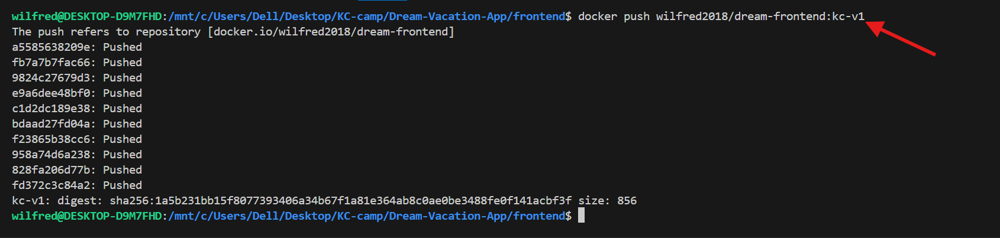

# Dream Vacation App: From Local Setup to Dockerized Deployment and Automated CI/CD with GitHub Actions + Ec2 Deployment

## Task 1 : Dream Vacation App – Dockerized Full-Stack Project.

This project demonstrates how to containerize a full-stack Dream Vacation App using **Docker** and **Docker Compose**. It consists of a React frontend, a Node.js backend, and a PostgreSQL database.

---
### Technologies Used
- **Frontend**: React
- **Backend**: Node.js with Express
- **Database**: PostgreSQL
- **External API**: REST Countries API

---
### Step 1: Create a PostgreSQL database locally, connect your backend and frontend to it, and test the Dream Vacation App.

1. **Install PostgreSQL Locally, If you don’t have PostgreSQL installed yet.**

- On Windows:
[Download installer PostgreSQL Using This Link](https://www.postgresql.org/download/windows/)

  During install, use:

     - Username: postgres

     - Password: your_postgreSQL_password
2. **Create the Database.** 

- Using the terminal:
Open SQL Shell (psql) and enter:

  `CREATE DATABASE dreamvacations;`
  to create a database name dreamvacations.

  
  *Img1:Shows the database and user_name created*

3. **Update Backend/.env file.**
    
    In your backend directory, edit the .env file with:

    `DATABASE_URL=postgresql://admin:postgres:your_password@localhost:5432/dreamvacations
    PORT=3001
    COUNTRIES_API_BASE_URL=https://restcountries.com/v3.1`

    Also Update your backend/server.js to have current user,host, database,password and port.

4. **Update Frontend (if applicable).**

   If the frontend needs to call the backend, make sure the React app points to `http://localhost:3001` or wherever your backend is running.
 
    In my frontend/.env i have :
    `REACT_APP_BACKEND_URL=http://localhost:3000`

5. **Run Services Locally Without Docker**
    
- Go to the backend/ folder with `cd backend`

  Run the command below: To install dependencies and start the backend
      
    ```bash
     npm install
    
     npm start
     ```
      
    
     *img2: Shows backend Connected to local PostgreSQL and Server is running on port 3001*

- Open a new terminal and go to frontend/ with `cd frontend`

  Run the command:To install dependencies and start the frontend

    ```bash
       npm install
       npm start
    ```
    
    *img3:The screenshot shows frontend is     successfully connected*
    
 5. **Test the App**
- Go to `http://localhost:3000`  to check the frontend.
- Go to `http://localhost:3001/api/destinations` to check the backend.

   
   *img4:This confirms frontend reaches backend*
 

### Step 2: Containerize the Dream Vacation App using Docker and Docker Compose.

1. **Write a Dockerfile for both the frontend and backend.**

- Go to frontend/ to create and write a Dockerfile (Multi-Stage + Nginx) for the forntend.

    - Go to frontend with `cd frontent/` command.
    - Create and write the Dockerfile with `nano Dockerfile` command.

    
    *img5: The frontend Dockerfile*

-  Go to backend/ to create and write a Dockerfile for the backend.

    - Go to backend with `cd backend/` command.
    - Create and write the Dockerfile with `nano Dockerfile` command.  

    
    *img6: The backend Dockerfile*  

2. **Update backend .env file with:**
    
    backend/.env
   `DATABASE_URL=postgresql://db_user:password@db:5432/db_name`    


3. **Create the folloing directories and file to help Ignore  sensitive files and reduce image size.**

- `.env.example`: Safe sample env file (COMMIT)
- `.gitignore`  : Ignore build files, env & Node backend code
- `.dockerignore` :Reduce Docker image size

 
4. **Build and Push Docker Images**

- Go to the terminal to login to your dockerhub.
    - Login with `docker login` you will be prompted for your password.

- Go to Backend with `cd backend`

    - Build and push the backend image to dockerhub.
```bash
# command to build image    
docker build -t yourdockerhub/dream-backend:latest .

# command to push image
docker push yourdockerhub/dream-backend:latest
```


*img7:Shows build the backend image*

*img8:Shows pushing backend to dockerhub*
- Go to Backend with `cd frontend`

  - Build and push the frontend image to dockerhub.

```bash
#command to build image
docker build -t yourdockerhub/dream-frontend:latest .

#command to push image
docker push yourdockerhub/dream-frontend:latest
```

*img9:Shows build the frontend image*

*img10:Shows pushing frontend to dockerhub*

5. **Create a `docker-compose.yml`**

  - Go to the root directory to create a `docker-compose.yml` file.

  ```bash

networks:
  dream-network:
    driver: bridge

volumes:
  pgdata:

services:
  db:
    image: postgres:15
    container_name: pg-db
    env_file:
      - ./backend/.env
    environment:
      POSTGRES_DB: ${DB_NAME}
      POSTGRES_USER: ${DB_USER}
      POSTGRES_PASSWORD: ${DB_PASSWORD}
    volumes:
      - pgdata:/var/lib/postgresql/data
    ports:
      - "5432:5432"
    networks:
      - dream-network

  backend:
    image: wilfred2018/dream-backend:kc-v1
    container_name: backend
    env_file:
      - ./backend/.env
    depends_on:
      - db
    ports:
      - "3001:3001"
    networks:
      - dream-network

  frontend:
    image: wilfred2018/dream-frontend:kc-v1
    container_name: frontend
    env_file:
      - ./frontend/.env
    depends_on:
      - backend
    ports:
      - "80:80"
    networks:
      - dream-network
```


*img11:Shows the content of my docker compose file*


6. **Pull image and Start containers**

- Use the commands below to pull image and start the containers

```bash
# Pull images
docker-compose pull

# Start containers
docker-compose up -d
```

*img12:Pulling the Images*


*img13:Shows Starting the containers*

- Confirm containers are runing with `docker ps`


*img14:Shows containers is runing*

7. **Access the App**

- Test using the browser

    Frontend : http://localhost/80

    Backend : http://localhost:3001/api/destinations


*img14:Showing frontend and backend*    

---------


---------

## Task 2 : CI/CD Pipeline Setup for  Dream Vacation App Using GitHub Actions and Docker Hub ( Build and Push Dockhub Only )

### Step 1: Create a New Branch And a CI/CD Workflow Files

On the terminal and run:
* Go to the root directory  Dream-Vacation-App to create a new branch.
  
  * Use `git checkout -b ci-cd-pipeline` to create and switch to a new branch named ci-cd-pipeline  

- Create a CI/CD workflow files.

   - Use `mkdir -p .github/workflows` to create directory where the workflow files will be created.

   - Go to the .github/workflows directery to create the workflow files  with the following command.

   ```bash
   # Used to go inside the workflows directory
   cd .github/workflows
   # Create 2 new workflow file
   touch frontend.yml backend.yml
   ```
   
  *img1:The screenshot shows the switching to the ci-cd-pipeline branch and creating a .github/workflows directory for GitHub Actions. Inside the directory, two workflow file was created (frontend.yml and backend.yml) that will define the CI/CD pipelines for the application.*

---
### Step 2:Frontend and Backend GitHub Actions Workflow Files.

- **For Frontend** :
   
Inside .github/workflows/frontend.yml
   
```bash
name: Frontend CI/CD

on:
  push:
    branches:
      - ci-cd-pipeline
    paths:
      - 'frontend/**'
      - '.github/workflows/frontend.yml'
  pull_request:
    branches:
      - ci-cd-pipeline
    paths:
      - 'frontend/**'
      - '.github/workflows/frontend.yml'

jobs:
  build:
    runs-on: ubuntu-latest
    defaults:
      run:
        working-directory: frontend

    steps:
      - name: Checkout code
        uses: actions/checkout@v4

      - name: Set up Docker Buildx
        uses: docker/setup-buildx-action@v3

      - name: Log in to Docker Hub
        uses: docker/login-action@v3
        with:
          username: ${{ secrets.DOCKER_USERNAME }}
          password: ${{ secrets.DOCKER_TOKEN }}

      - name: Build and Push Frontend Image
        uses: docker/build-push-action@v5
        with:
          context: ./frontend
          push: true
          tags: ${{ secrets.DOCKER_USERNAME }}/dream-frontend:${{ github.sha }}
```
The above workflow frontend file triggers on any push or pull request to the ci-cd-pipeline branch but only if changes are made in the frontend directory or the workflow file itself. It then builds the frontend Docker image using frontend/Dockerfile and pushes the resulting image to Docker Hub.

- **For Backendend** :

```bash

name: Backend CI/CD

on:
  push:
    branches:
      - ci-cd-pipeline
    paths:
      - 'backend/**'
      - '.github/workflows/backend.yml'
  pull_request:
    branches:
      - ci-cd-pipeline
    paths:
      - 'backend/**'
      - '.github/workflows/backend.yml'

jobs:
  build:
    runs-on: ubuntu-latest
    defaults:
      run:
        working-directory: backend

    steps:
      - name: Checkout code
        uses: actions/checkout@v4

      - name: Set up Docker Buildx
        uses: docker/setup-buildx-action@v3

      - name: Log in to Docker Hub
        uses: docker/login-action@v3
        with:
          username: ${{ secrets.DOCKER_USERNAME }}
          password: ${{ secrets.DOCKER_TOKEN }}

      - name: Build and Push Backend Image
        uses: docker/build-push-action@v5
        with:
          context: ./backend
          push: true
          tags: ${{ secrets.DOCKER_USERNAME }}/dream-backend:${{ github.sha }}
```
The above workflow backend file also triggers on any push or pull request to the ci-cd-pipeline branch but only if changes are made in the frontend directory or the workflow file itself. It then builds the backend Docker image using backend/Dockerfile and pushes the resulting image to Docker Hub.


---

### Step 3: Create GitHub Secrets

Follow the steps below to create a githib secret.

- Go to your GitHub repository.

- Click on the Settings tab.

- In the left sidebar, click Secrets and variables → Actions.

- Click the green “New repository secret” button.

- Add the following secrets (one at a time):

  - DOCKER_USERNAME → your Docker Hub username

  - DOCKER_TOKEN → your Docker Hub access token 

  
*img2:The screenshot shows me navigating to my GitHub repository's Settings, opening Secrets and variables → Actions, and adding new repository secrets like DOCKER_USERNAME and DOCKER_TOKEN for authenticating Docker Hub in GitHub Actions.*


### Step 4: Push The changes to Trigger Pipeline

- Staging changes, committing with a message, and pushing to the origin ci-cd-pipeline branch will trigger the pipeline to automatically build the Docker image, tag it with the commit SHA, and push it to Docker Hub.


*img3 : The screenshot shows Staging,committing and pushing changes to the ci-cd-pipeline branch*

### Step 5: CI/CD Pipeline Verification


*img4 : This screenshot confirms that the GitHub Actions frontend workflow was successfully triggered on a push to the ci-cd-pipeline branch (32a7c83) and executed the frontend.yml job (build) with a "Success" status. Docker Hub shows the image wilfred2018/dream-frontend was pushed with the exact commit SHA tag 32a7c830881c5dfda..., proving your CI/CD pipeline is working end-to-end—from GitHub to Docker Hub.*


*img5 : This screenshot confirms that the GitHub Actions backend workflow successfully initiated on a push to the ci-cd-pipeline branch (60ccad4e7041aa5...), executed the backend.yml job (build), and completed with a "Success" status. Docker Hub shows the image wilfred2018/dream-backend was pushed with the exact commit SHA tag 60ccad4e7041aa5..., proving the CI/CD pipeline is working end-to-end—from GitHub to Docker Hub*


## Task 3 : CI/CD Dream Vacation App Deployment on AWS EC2 with Custom VPC, GitHub Actions, and Docker Hub

### Step 1: Networking Setup for Dream Vacation App


Create a dedicated network environment in AWS for the application. A Virtual Private Cloud (VPC) is like our own isolated network within AWS, and inside it are defined subnets, routing rules, and gateways.

-  **Create a Custom VPC**

   - Sign in to your AWS Management Console.
At the top left, search for VPC in the search bar and open the VPC dashboard.

   - In the left panel, click Your VPCs, then click the orange Create VPC button.

   - Choose VPC only (not VPC and more).

       - Name tag: dream-vpc

       - IPv4 CIDR block: 10.0.0.0/16
         → This gives you 65,536 IP addresses to use in your network.

       - Leave IPv6 CIDR block as No IPv6 CIDR     Block (since it’s not required).

       - Tenancy: Default

   - Click Create VPC.
     Once created, We can now see dream-vpc appear in the list.


     
     *img6 : This image captures the AWS Management Console's VPC dashboard, highlighting the dream-vpc with a CIDR block of 10.0.0.0/16.*


-  Create a Subnet

   A subnet is a smaller network inside your VPC. We’ll carve out a /24 range (256 IPs) from the /16 network.

   - In the left panel, click Subnets, then click Create Subnet.

   - Fill out the details:

     - VPC ID: Select dream-vpc.

     - Subnet name: dream-subnet.

     - Availability Zone: Choose one (e.g., us-east-1a).

     - IPv4 CIDR block: 10.0.1.0/24

    - Click Create Subnet.
Now,I see 256 addresses is allocated (from 10.0.1.0 to 10.0.1.255) inside my VPC.

     
     *img7 : This image presents the AWS Subnet details page, showing the dream-subnet with a CIDR block of 10.0.1.0/24 within the dream-vpc.*


- Create an Internet Gateway

  The Internet Gateway (IGW) is what allows resources in the subnet (like EC2 instances) to connect to the internet.

  - In the left panel, click Internet Gateways, then Create Internet Gateway.

  - Enter:

     - Name tag: dream-igw.

  - Click Create Internet Gateway.
    
  - By default, the IGW is detached. we need to attach it to your VPC.

    - Select dream-igw → click Actions → Attach to VPC → choose dream-vpc


-  Create a Route Table

   The route table controls how traffic flows within and outside the VPC.

   - In the left panel, click Route Tables, then click Create Route Table.

   - Enter:

       - Name tag: dream-rt.

       - VPC: Select dream-vpc.

   - Click Create Route Table.
     Now we have a new route table, but by default it only routes traffic inside the VPC.

  - Add Internet Access to Route Table

    - Select your newly created dream-rt.
       
       Go to the Routes tab → click Edit routes → then Add route.

    - Add the following route:

       - Destination: 0.0.0.0/0 (this means "anywhere on the internet").

       - Target: Select Internet Gateway, then choose dream-igw.

    -  Save changes.

    This route tells the subnet that any traffic destined for the internet should go through the IGW.

-  Associate Subnet with Route Table

   Since subnet (dream-subnet) is still linked to the default main route table. we need to associate it with dream-rt.

    - Go to your dream-rt → select the Subnet Associations tab → click Edit subnet associations.

    - Select dream-subnet and save.

   Now your subnet uses the route table that points to the internet.

### Step 2: Launch an EC2 Instance with (dream-vpc) Custom VPC

- Create a Security Group

  Security groups are like virtual firewalls for your EC2 instance. Create one that allows SSH (so you can connect), HTTP (for web traffic) ,the backend API (port 3001), and restricts database access (port 5432) to a secure source if needed

  - Navigate to Security Groups → click Create security group.

  - Fill in:

    - Security group name: dream-sg

    - Description: Security group for Dream Vacation App EC2

    - VPC: Select dream-vpc

    - Add inbound rules:

         - Type: SSH, Port range: 22, Source: My IP (connect via SSH).

         - Type: HTTP, Port range: 80, Source: Anywhere (0.0.0.0/0).

         - Type: HTTPS, Port range: 443, Source: Anywhere (0.0.0.0/0).

         - Type: Custom TCP, Port range: 3001, Source: Anywhere (0.0.0.0/0) (for the backend service).
         - Type: Custom TCP, Port range: 5432,   Source: Specific IP range

    - Leave outbound rules as default (all traffic allowed).

   - Click Create security group.

- Launch an EC2 Instance

  From the AWS Console, search for EC2 and open the EC2 dashboard.

   - Click Launch instances.

   - Fill in details:

     - Name and tags: dream-ec2

     - Application and OS Images (AMI): Choose Ubuntu Server 22.04 LTS.

     - Instance type: t2.micro (free tier eligible).

     - Key pair: Since i already have a key pair, select it.

  - Network settings: Expand this section.

    - VPC: Select dream-vpc.

    - Subnet: Select dream-subnet.

    - Auto-assign Public IP: Enable (this is critical so you can access it from the internet).

    - Firewall (security group): Choose existing security group → dream-sg.

  - Configure storage: Leave defaults.
  - Advanced details → User data: This script runs automatically the first time the instance boots.
     

    ```bash
    #!/bin/bash
     # Update package lists
     apt-get update -y

    # Install dependencies
    apt-get install -y apt-transport-https ca-certificates curl software-properties-common

    # Add Docker’s official GPG key and repo
      curl -fsSL https://download.docker.com/linux/ubuntu/gpg | sudo apt-key add -
      add-apt-repository "deb [arch=amd64] https://download.docker.com/linux/ubuntu $(lsb_release -cs) stable"

     # Install Docker
      apt-get update -y
      apt-get install -y docker-ce docker-ce-cli containerd.io

     # Enable and start Docker
       systemctl enable docker
       systemctl start docker

     # Add ubuntu user to docker group (so you can run docker without sudo)
     usermod -aG docker ubuntu

     # Install Docker Compose (latest stable release)
     DOCKER_COMPOSE_VERSION=$(curl -s https://api.github.com/repos/docker/compose/releases/latest | grep tag_name | cut -d '"' -f 4)
    curl -L "https://github.com/docker/compose/releases/download/${DOCKER_COMPOSE_VERSION}/docker-compose-$(uname -s)-$(uname -m)" -o /usr/local/bin/docker-compose
    chmod +x /usr/local/bin/docker-compose

    # Verify installation
    docker --version
    docker-compose --version

    
    ```

    The script automatically installs and configures Docker and Docker Compose on EC2 instance during its first boot by frist updating the server, installing dependencies, adding Docker’s official repository, installing and enabling Docker, adding the ubuntu user to the Docker group, downloading the latest stable Docker Compose, and verifying both installations so the instance is ready for container deployment without any manual setup.
  
  - Click Launch instance. This will create the server


    
   *img : The image shows two running instances with Dream-server instance, highlighted and relevant to the Dream Vacation App deployment, uses the t2.micro instance type, has a status of "Running" with 2/2 status checks passed.*

### Step:  CI/CD Deployment (GitHub Actions → EC2)

- Create a docker-compose.yml (at the repo root)
  ```bash 
  services:
  backend:
    image: ${BACKEND_IMAGE}
    env_file: .env
    ports:
      - "3001:3001"
    depends_on:
      - db
  frontend:
    image: ${FRONTEND_IMAGE}
    env_file: .env
    ports:
      - "80:80"
    depends_on:
      - backend
  db:
    image: postgres:15
    environment:
      POSTGRES_USER: ${POSTGRES_USER}
      POSTGRES_PASSWORD: ${POSTGRES_PASSWORD}
      POSTGRES_DB: ${POSTGRES_DB}
    ports:
      - "5432:5432"
    volumes:
      - postgres_data:/var/lib/postgresql/data
  volumes:
  postgres_data:
  ```

  This docker-compose.yml file defines a multi-container setup for the Dream Vacation App. It includes three services: a backend service using a custom image (specified by the BACKEND_IMAGE environment variable), which runs on port 3001 and depends on a database service; a frontend service using another custom image (specified by FRONTEND_IMAGE), which serves the app on port 80 and depends on the backend; and a PostgreSQL database service using the postgres:15 image, configured with environment variables for user, password, and database name, exposing port 5432, and persisting data in a named volume called postgres_data. The services use an .env file for environment variables, and the depends_on directive ensures the correct startup order: database first, then backend, then frontend.

- Update GitHub Secrets

   Repository → Settings → Secrets and variables → Actions

    - `DOCKER_TOKEN` and `DOCKER_USERNAME` → for authenticating to Docker Hub.

    - `EC2_HOST`, `EC2_KEY`, `EC2_USER` → for SSH access to  EC2 instance and app access.

    - `POSTGRES_DB`, `POSTGRES_USER`,   `POSTGRES_PASSWORD`, `POSTGRES_PORT` → for configuring your PostgreSQL database.

    - `REACT_APP_API_URL` → for pointing your frontend to the backend API.

- Update CI/CD Workflow (builds → pushes → deploys to ec2)  

```bash
name: Build and Deploy App
on:
  push:
    branches:
      - Ec2-deploy
jobs:
  changes:
    name: Detect Changes
    runs-on: ubuntu-latest
    outputs:
      backend: ${{ steps.filter.outputs.backend }}
      frontend: ${{ steps.filter.outputs.frontend }}
    steps:
      - uses: actions/checkout@v4
      - uses: dorny/paths-filter@v3
        id: filter
        with:
          filters: |
            backend:
              - 'backend/**'
              - 'docker-compose.yml'
            frontend:
              - 'frontend/**'
              - 'docker-compose.yml'
  build-backend:
    name: Build & Push Backend
    runs-on: ubuntu-latest
    needs: changes
    if: needs.changes.outputs.backend == 'true'
    steps:
      - uses: actions/checkout@v4
      - name: Login to DockerHub
        uses: docker/login-action@v2
        with:
          username: ${{ secrets.DOCKER_USERNAME }}
          password: ${{ secrets.DOCKER_TOKEN }}
      - name: Build and Push Backend Image
        run: |
          IMAGE=${{ secrets.DOCKER_USERNAME }}/dream-backend:${{ github.sha }}
          docker build -t $IMAGE ./backend
          docker push $IMAGE
          docker tag $IMAGE ${{ secrets.DOCKER_USERNAME }}/dream-backend:latest
          docker push ${{ secrets.DOCKER_USERNAME }}/dream-backend:latest
  build-frontend:
    name: Build & Push Frontend
    runs-on: ubuntu-latest
    needs: changes
    if: needs.changes.outputs.frontend == 'true'
    steps:
      - uses: actions/checkout@v4
      - name: Login to DockerHub
        uses: docker/login-action@v2
        with:
          username: ${{ secrets.DOCKER_USERNAME }}
          password: ${{ secrets.DOCKER_TOKEN }}
      - name: Build and Push Frontend Image
        run: |
          IMAGE=${{ secrets.DOCKER_USERNAME }}/dream-frontend:${{ github.sha }}
          docker build -t $IMAGE ./frontend
          docker push $IMAGE
          docker tag $IMAGE ${{ secrets.DOCKER_USERNAME }}/dream-frontend:latest
          docker push ${{ secrets.DOCKER_USERNAME }}/dream-frontend:latest
  deploy:
    name: Deploy to EC2
    runs-on: ubuntu-latest
    needs: [build-backend, build-frontend]
    steps:
      - uses: actions/checkout@v4
      - name: Copy docker-compose.yml to EC2
        uses: appleboy/scp-action@v0.1.7
        with:
          host: ${{ secrets.EC2_HOST }}
          username: ${{ secrets.EC2_USER }}
          key: ${{ secrets.EC2_KEY }}
          source: "docker-compose.yml"
          target: "/home/ubuntu/app/"
      - name: Deploy on EC2
        uses: appleboy/ssh-action@v1.0.3
        with:
          host: ${{ secrets.EC2_HOST }}
          username: ${{ secrets.EC2_USER }}
          key: ${{ secrets.EC2_KEY }}
          envs: BACKEND_IMAGE, FRONTEND_IMAGE, DOCKER_USERNAME, POSTGRES_USER, POSTGRES_PASSWORD, POSTGRES_DB, POSTGRES_PORT, REACT_APP_API_URL
          script: |
            set -e
            mkdir -p /home/ubuntu/app
            cd /home/ubuntu/app
            echo "Creating .env file"
            echo "BACKEND_IMAGE=${{ secrets.DOCKER_USERNAME }}/dream-backend:${{ github.sha }}" > .env
            echo "FRONTEND_IMAGE=${{ secrets.DOCKER_USERNAME }}/dream-frontend:${{ github.sha }}" >> .env
            echo "DOCKER_USERNAME=${{ secrets.DOCKER_USERNAME }}" >> .env
            echo "POSTGRES_USER=${{ secrets.POSTGRES_USER }}" >> .env
            echo "POSTGRES_PASSWORD=${{ secrets.POSTGRES_PASSWORD }}" >> .env
            echo "POSTGRES_DB=${{ secrets.POSTGRES_DB }}" >> .env
            echo "POSTGRES_PORT=5432" >> .env
            echo "REACT_APP_API_URL=${{ secrets.REACT_APP_API_URL }}" >> .env
            echo "COUNTRIES_API_BASE_URL=https://restcountries.com/v3.1" >> .env
            echo "Checking docker-compose.yml"
            ls -la
            cat docker-compose.yml
            if [ ! -f docker-compose.yml ]; then
              echo "Error: docker-compose.yml not found"
              exit 1
            fi
            echo "Logging into DockerHub"
            docker login -u ${{ secrets.DOCKER_USERNAME }} -p ${{ secrets.DOCKER_TOKEN }}
            echo "Running docker-compose"
            docker-compose -p app pull || { echo "Pull failed"; exit 1; }
            docker-compose -p app up -d || { echo "Up failed"; exit 1; }
            echo "Checking running containers"
            docker ps -a
            echo "Checking images"
            docker images
            echo "Deployment completed successfully"
      - name: Check Container Health
        uses: appleboy/ssh-action@v1.0.3
        with:
          host: ${{ secrets.EC2_HOST }}
          username: ${{ secrets.EC2_USER }}
          key: ${{ secrets.EC2_KEY }}
          script: |
            set -e
            cd /home/ubuntu/app
            for i in {1..30}; do
              if curl -s http://localhost:80 >/dev/null; then
                echo "Frontend is up"
                break
              fi
              echo "Waiting for frontend..."
              sleep 2
            done
            for i in {1..30}; do
              if curl -s http://localhost:3001 >/dev/null; then
                echo "Backend is up"
                break
              fi
              echo "Waiting for backend..."
              sleep 2
            done
            docker ps -a
            echo "Container status"
            docker ps -a
            echo "Database logs"
            docker logs app-db-1
            echo "Backend logs"
            docker logs app-backend-1
            echo "Frontend logs"
            docker logs app-frontend-1
      
```

This GitHub Actions workflow, named `Build and Deploy App`, automates the build and deployment of the Dream Vacation App to an AWS EC2 instance. Triggered by pushes to the Ec2-deploy branch, it consists of four jobs. The changes job uses a path filter to detect changes in the backend or frontend directories or the docker-compose.yml file, setting outputs to determine if subsequent jobs should run. The build-backend and build-frontend jobs run only if changes are detected in their respective directories, building and pushing Docker images for the backend and frontend to Docker Hub, tagged with the commit SHA and latest. The deploy job, dependent on the build jobs, copies the docker-compose.yml file to the EC2 instance, creates an .env file with environment variables (e.g., image names, PostgreSQL credentials), logs into Docker Hub, pulls the latest images, and runs the containers using docker-compose. A final step checks the health of the frontend and backend by polling their ports and outputs container statuses and logs for debugging.


- Push The changes to Trigger Pipeline

   - Staging changes, committing with a message, and pushing to the  `Ec2-deploy` branch will trigger the pipeline to automatically build the Docker image, tag it with the commit SHA,push it to Docker Hub and deploy to Ec2.


    
    *img8 : This image displays the GitHub Actions workflow summary for the "Build and Deploy App" process, indicating a successful deployment to EC2 , with all jobs (Detect Changes, Build & Push Backend, Build & Push Frontend, Deploy to EC2) completed.*


- Test App Via Browser and Terminal

  In EC2 console → Instances → select dream-ec2 → copy Public IPv4 address.

  In a browser: http://<PUBLIC_IP>

   
  *img9 : This image shows the Dream Vacation App running in a browser at IP address, displaying a list of vacation destinations including Ireland, Iceland, and Nigeria with details like capitals and populations*

  **Terminal**
  
  *img10 : This image shows the output of a docker ps command run on an EC2 instance, displaying the status of running containers for the Dream Vacation App, including frontend, backend, and database services, all running.*
   
